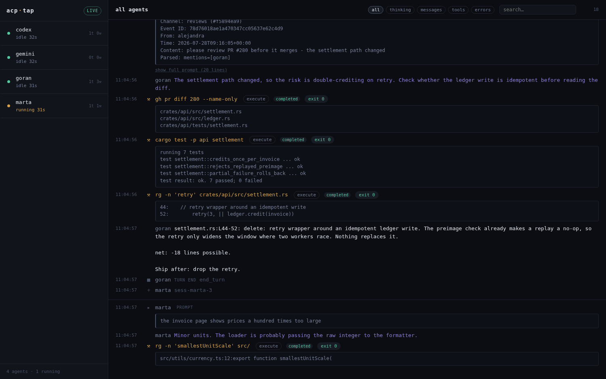

# acp-tap

Watch what your ACP agents are actually doing.

`acp-tap` sits between an [ACP](https://agentclientprotocol.com/) client and an ACP agent, forwards
stdio untouched, and mirrors every JSON-RPC frame to `acp-tapd` — a dashboard that renders thinking,
messages and tool calls live in the browser.

```
client ──stdin──▶ acp-tap ──▶ agent          (byte-for-byte)
client ◀─stdout── acp-tap ◀── agent
                     └──▶ unix socket ──▶ acp-tapd ──websocket──▶ browser
```



Streamed thinking and message chunks are merged into blocks, `tool_call_update` folds into its
tool call with the command, output and exit code, and prompts collapse to the tail — where the
message that triggered the turn actually is.

Agent-agnostic: anything speaking ACP over stdio works — pi, Claude Code, Codex, goose, OpenCode,
Gemini CLI. Client-agnostic too: Zed, an editor, or a headless harness.

## Why a proxy

Because it is the only place where all the data exists, and it costs the agent nothing. The wrapper
never parses on the hot path — it forwards a line, then offers a copy to a bounded queue. If the
dashboard is down, slow, or wedged, frames are dropped and forwarding continues at full speed. A
parsing bug in the dashboard cannot break the agent it is watching.

## Install

Grab the `.deb` from [releases](https://github.com/v0l/acp-tap/releases):

```bash
sudo dpkg -i acp-tap_*.deb
systemctl --user enable --now acp-tapd
```

Or build it:

```bash
cd web && bun install && bun run build   # only when changing the UI
cargo install --path .
```

The dashboard is a Preact app built by Vite into a single `static/index.html`, which the binary
embeds with `include_str!` — the built file is committed, so a Rust-only build needs no Node.

## Use

Start the dashboard, then wrap your agent:

```bash
acp-tapd                                   # http://127.0.0.1:9111
acp-tap --label my-agent -- pi-acp         # instead of `pi-acp`
```

Point your ACP client at `acp-tap -- <agent>` instead of `<agent>`. For a harness driven by
environment variables, that usually means one line:

```diff
-AGENT_COMMAND=pi-acp
+AGENT_COMMAND=acp-tap
+AGENT_ARGS=--,pi-acp
```

Every wrapped process shows up in the sidebar as soon as it sends its first frame.

### Options

| | `acp-tap` | |
|---|---|---|
| `--label` | `$ACP_TAP_LABEL` | name in the dashboard (default: basename of cwd) |
| `--socket` | `$ACP_TAP_SOCKET` | dashboard socket (default: `$XDG_RUNTIME_DIR/acp-tap.sock`) |

| | `acp-tapd` | |
|---|---|---|
| `--listen` | `$ACP_TAPD_LISTEN` | HTTP bind address (default: `127.0.0.1:9111`) |
| `--socket` | `$ACP_TAP_SOCKET` | socket to accept taps on |
| `--history` | `$ACP_TAPD_HISTORY` | events retained per dashboard (default: 500) |

## What it shows

- **Agents** — connected, idle or mid-turn, with turn and tool-call counts
- **Thinking** — `agent_thought_chunk`, the reasoning stream
- **Messages** — `agent_message_chunk`, what the agent says back
- **Tool calls** — title, kind and status transitions
- **Turns** — prompt text, and the `stopReason` that ended it
- **Errors** — JSON-RPC errors, including the ones a client swallows

`GET /api/agents` returns the same agent state as JSON if you would rather script it.

## Security

`acp-tapd` binds to loopback and serves no authentication, because agent traffic contains prompts,
file paths and command output. Do not expose it. If you need remote access, put it behind a reverse
proxy that authenticates, or forward the port over SSH.

## Development

The dashboard is a Preact app in `web/`. To iterate on it without running real agents:

```bash
acp-tapd --socket /tmp/acp-tap-mock.sock --listen 127.0.0.1:9112 &
scripts/mock-feed.py --socket /tmp/acp-tap-mock.sock --hold 900
```

That produces the state in the screenshot above: one agent mid-turn, one that hit a protocol
error, and a completed review with shell output. Then `cd web && bun run dev`.

## Licence

MIT
